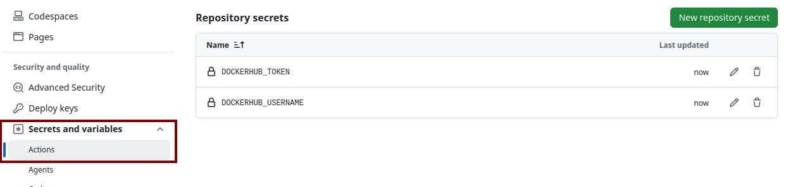

# lex-agent-rpa
Under development

## Description
RPA-based agentic system for autonomous management of archives and legal documents.

> [!NOTE]
> If you have a machine with a dedicated GPU (16+ GB VRAM), you can self-host an NVIDIA NIM model locally via Docker Compose.
> For details, see the [NVIDIA Compose Reference](https://docs.nvidia.com/ai-workbench/user-guide/latest/reference/projects/compose-reference.html).

---

## Getting Started: Complete Step-by-Step Workflow

Follow the steps below in exact order to provision the cloud infrastructure, configure credentials, set up local environment variables, and run the agent system.

### 1. Provision Azure Infrastructure (Terraform)
Log in to your Azure account and provision cloud resources (Resource Group, Key Vault, Storage Account, and Blob Container):

```bash
az login
cd src/infrastructure/templates
terraform init
terraform apply
cd ../../..
```

### 2. Configure Azure IAM, Key Vault Secrets & Entra ID (Setup Scripts)
Run the automated scripts in `scripts/` to configure permissions and services:

1. **Grant Blob Storage RBAC access (`Storage Blob Data Contributor`):**
   ```bash
   ./scripts/setup-blob-rbac.sh
   ```

2. **Populate Key Vault with required secrets (`PostgresPassword`, `TavilyApiKey`, `NvidiaApiKey`):**
   ```bash
   ./scripts/setup-keyvault-secrets.sh
   ```

3. **Configure Microsoft Graph API in Entra ID (for Outlook email attachments):**
   ```bash
   ./scripts/setup-ms-graph.sh
   ```
   *(The script outputs your `AZURE_TENANT_ID`, `AZURE_CLIENT_ID`, and `AZURE_CLIENT_SECRET`).*

### 3. Configure Local Environment & Slack Webhook (`.env`)
Create your `.env` file from the template and fill in your Slack webhook and MS Graph details:

```bash
cp .env-example .env
```
Open `.env` and fill in:
* `SLACK_WEBHOOK_URL`: Your incoming Slack webhook URL for notifications and alerts.
* `AZURE_TENANT_ID`, `AZURE_CLIENT_ID`, `AZURE_CLIENT_SECRET`: Generated in step 2.3.
* `MS_GRAPH_MAILBOX_USER`: The target mailbox address (e.g. `kancelaria@twojadomena.pl`).

### 4. Export Secrets from Key Vault to Shell
Export runtime API keys and passwords from Azure Key Vault into your active terminal:

```bash
source ./scripts/nvidia-secret-export.sh
source ./scripts/postgres-secret-export.sh
source ./scripts/tavily-secret-export.sh
```

### 5. Configure Docker Registry Authentication (Linux optional)
> [!IMPORTANT]
> By default on Linux, Docker stores credentials in plain text inside `~/.docker/config.json`.
> Run this helper script to store registry credentials securely in an encrypted `pass` (GPG) store:

```bash
./scripts/setup-docker-pass.sh
```

### 6. Run Application Stack (API + PostgreSQL)
Start the containers (FastAPI microservice and PostgreSQL with pgvector):

```bash
docker compose up -d
```

Initialize the database schema (extensions and `legal_documents` table):
```bash
docker compose exec -T db psql -U lex_user -d lex_agent_db < src/infrastructure/database/template.sql
```

### 7. Run Automated Tests
Run tests inside Docker:

```bash
docker compose run --rm tests
```

Or run tests locally using pytest:
```bash
pytest tests/unit/
```

### 8. Clean up Cloud Resources (Optional)
When you are done and want to tear down all Azure infrastructure to avoid costs:

```bash
cd src/infrastructure/templates
terraform destroy
cd ../../..
```

---

## CI/CD Pipeline Secrets (GitHub Actions)
To enable automated building and pushing of Docker images on `git push` to `main`, configure the following repository secrets:

1. **Generate Docker Hub Access Token:**
   * Go to [Docker Hub Account Settings](https://hub.docker.com/settings/security) -> **Security**.
   * Click **New Access Token**, grant **Read & Write** permissions, and copy the generated token.

2. **Add Secrets in GitHub:**
   * In your repository on GitHub, navigate to:
     `Settings` -> `Secrets and variables` -> `Actions`.
   * Under **Repository secrets**, click **New repository secret** and add:
     * `DOCKERHUB_USERNAME`: Your Docker Hub username.
     * `DOCKERHUB_TOKEN`: The Personal Access Token generated above.


